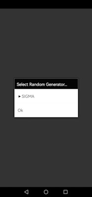
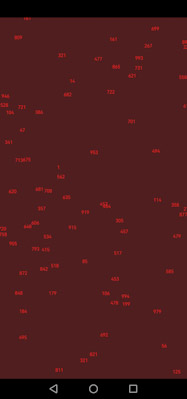
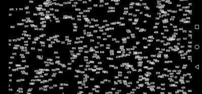

# RND1n
[Demo movie](https://m.youtube.com/watch?v=0J0xG1YMkxs&t=20s)

Random Number Screen `RND1n`: Screensaver for Android platforms, which generates random number sequences (c.f. Schrausser, 1996, p. , 2022b, p. , res.) and displays them in a random order on the screen. Both, the system's own and the *SIGMA* quasi-random function $n_\varsigma$ are used, where

$$n_\varsigma=r_{n^\varsigma}-int(r_{n^\varsigma}).$$

See Schrausser (2022a, p. 17).

## References

Schrausser, D. G. (1996). Permutationstests: Theoretische und praktische Arbeitsweise von Permutationsverfahren beim unverbundenen 2 Stichprobenproblem. *Diplom*. Institut für Psychologie, Karl Franzens Universität, Graz. http://doi.org/10.13140/RG.2.2.24500.32640/1

———. (2022a). Mathematical-Statistical Algorithm Interpreter,
SCHRAUSSER-MAT: Function Index, Manual. *Handbooks*. Academia.
https://doi.org/10.13140/RG.2.2.28314.52164.

———. (2022b). Thesis chapter 1: Introduction. In: *Permutation tests:...*. Thesis. Karl Franzens University, Institute of Psychology. Academia. https://www.academia.edu/82224369
