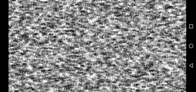

# RND1n
Screensaver for Android platforms, which generates random number sequences and displays them in a random order on the screen. Both the system's own and the SIGMA quasi-random function are used.

